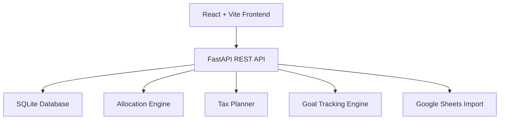

<div align="center">

# 💰 Smart Budget Tracker & Asset Allocator

### Production-ready full-stack personal finance platform for budgeting, smart allocation, tax planning, and financial goal tracking.

<p>
  
  
  
</p>

<p>
  
  
  
</p>

<p>
  <a href="#-overview">Overview</a> •
  <a href="#-features">Features</a> •
  <a href="#-screenshots">Screenshots</a> •
  <a href="#-tech-stack">Tech Stack</a> •
  <a href="#-architecture">Architecture</a> •
  <a href="#-quick-start">Quick Start</a> •
  <a href="#-deployment">Deployment</a>
</p>

</div>

---

## 📌 Overview

**Smart Budget Tracker & Asset Allocator** is a production-ready personal finance platform that helps users manage income streams, expenses, savings goals, tax planning, and smart asset allocation through a responsive full-stack dashboard.

The project combines a modern React/Vite frontend, FastAPI backend architecture, dynamic financial allocation logic, Google Sheets integration, responsive mobile-first UI, and Dockerized deployment workflows.

It is designed as a **portfolio-grade engineering project** demonstrating full-stack development, REST API architecture, responsive UI engineering, deployment pipelines, financial logic systems, and production-ready project organization.

---

## 🌐 Live Demo

<div align="center">

|                    Frontend               |                  Backend API Docs                |
|-------------------------------------------|--------------------------------------------------|
| https://smart-budget-allocator.vercel.app | https://smart-budget-allocator.onrender.com/docs |

</div>

---

## ✨ Features

<table>
<tr>

<td width="33%" valign="top">

### 💳 Budgeting

- Multiple income streams
- Fixed & non-fixed expenses
- Monthly/yearly tracking
- Expense threshold warnings
- Dynamic budgeting workflows
- Editable financial logs

</td>

<td width="33%" valign="top">

### 📈 Financial Planning

- Smart allocation engine
- Savings goal tracking
- Investment target planning
- Tax planning workflows
- Goal progress monitoring
- Timeline estimations

</td>

<td width="33%" valign="top">

### 🚀 Engineering

- FastAPI REST APIs
- Responsive React dashboard
- Mobile table scrolling
- Dockerized architecture
- Vercel + Render deployment
- Google Sheets integration

</td>

</tr>
</table>

---

## 🧱 Tech Stack

<div align="center">

<table>
<tr>
<td align="center" width="33%">
<br/>
<b>Frontend</b><br/>
React • Vite • CSS3
</td>

<td align="center" width="33%">
<br/>
<b>Backend</b><br/>
FastAPI • SQLite • SQLAlchemy
</td>

<td align="center" width="33%">
<br/>
<b>DevOps</b><br/>
Docker • Git • GitHub
</td>
</tr>

<tr>
<td align="center">
<br/>
<b>Frontend Hosting</b><br/>
Vercel
</td>

<td align="center">
<br/>
<b>Backend Hosting</b><br/>
Render
</td>

<td align="center">
<br/>
<b>Integrations</b><br/>
Google Sheets API
</td>
</tr>
</table>

</div>

---

## 📸 Screenshots

<p align="center">
  
  
  
</p>

## 🎯 Current Financial Targets

<div align="center">

|    Account   | Current | Target |
|--------------|---------|--------|
|   Chequing   |   1100  |   5000 |
|   Savings    |    400  |  20000 |
| WealthSimple |    500  |  10000 |

</div>

Monthly Income: `3600`

---

## 🏗️ Architecture



### System Flow

| Step |                        Description                      |
|------|---------------------------------------------------------|
|  1   | User enters income, expenses, goals, and financial data |
|  2   | Frontend sends requests to FastAPI APIs                 |
|  3   | Backend validates and stores financial data             |
|  4   | Allocation engine computes savings and goal progress    |
|  5   | Dashboard visualizes financial insights                 |
|  6   | Logs and goals persist across sessions                  |

---

## 🧠 Engineering Highlights

|          Area        |                        Highlights                   |
|----------------------|-----------------------------------------------------|
| Frontend Engineering | Responsive React/Vite dashboard with mobile support |
| Backend Engineering  | Modular FastAPI REST architecture                   |
| Financial Logic      | Dynamic smart allocation engine                     |
| Mobile Optimization  | Horizontal table scrolling and adaptive layouts     |
| Deployment           | Vercel frontend and Render backend                  |
| DevOps               | Dockerized deployment workflows                     |
| UX Engineering       | Touch-friendly responsive finance workflows         |
| Integrations         | Google Sheets CSV/API synchronization               |

---

## 📁 Project Structure

```text
smart-budget-allocator/
├── backend/
│   ├── app/
│   │   ├── api/
│   │   ├── core/
│   │   ├── models/
│   │   ├── schemas/
│   │   └── main.py
│   ├── tests/
│   ├── requirements.txt
│   └── Dockerfile
│
├── frontend/
│   ├── src/
│   │   ├── api/
│   │   ├── components/
│   │   ├── App.jsx
│   │   ├── main.jsx
│   │   └── styles.css
│   ├── package.json
│   └── Dockerfile
│
├── docs/
│   ├── screenshots/
│   ├── ARCHITECTURE.md
│   ├── DEPLOYMENT.md
│   ├── GOOGLE_SHEETS_SETUP.md
│   └── USER_GUIDE.md
│
├── google-sheets/
├── scripts/
├── docker-compose.yml
├── render.yaml
├── .env.example
└── README.md
```

---

## ⚡ Quick Start

### Backend

```bash
cd backend
python -m venv venv
pip install -r requirements.txt
uvicorn app.main:app --reload --port 8000
```

Backend:

```text
http://localhost:8000
```

API Docs:

```text
http://localhost:8000/docs
```

---

### Frontend

```bash
cd frontend
npm install
npm run dev
```

Frontend:

```text
http://localhost:5173
```

---

### Docker

```bash
docker compose up --build
```

---

## 🧾 Google Sheets Support

<table>
<tr>

<td width="50%" valign="top">

### 📥 CSV Import

- Export Google Sheets as CSV
- Upload directly into application
- Backend parses financial data
- Automatic synchronization

</td>

<td width="50%" valign="top">

### 🔗 Google Sheets API

- Google Cloud integration
- Service account authentication
- Live synchronization workflows
- Multi-sheet support

</td>

</tr>
</table>

See: [`docs/GOOGLE_SHEETS_SETUP.md`](docs/GOOGLE_SHEETS_SETUP.md)

---

## 🧮 Smart Allocation Logic

The backend calculates:

- current surplus
- savings gap
- investment gap
- monthly goal progress
- estimated months to goal
- recommended allocations

Default logic:

```text
IF chequing is below target:
    prioritize chequing + savings
ELSE IF savings is below target:
    prioritize savings + investments
ELSE:
    prioritize investments
```

---

## 📒 Monthly Logs System

|     Capability     |                      Description                     |
|--------------------|------------------------------------------------------|
| Yearly logs        | January to December tracking                         |
| Year selector      | Dynamic selection from 2020 to 2050                  |
| Editable cells     | Income and expense entries can be updated            |
| Auto totals        | Monthly income, expenses, and balance are calculated |
| Current month sync | Ongoing month updates reflect across related tabs    |
| Responsive view    | Horizontal scrolling for mobile screens              |

---

## 📱 Mobile Support

The application is optimized for:

- Android
- iPhone
- tablets
- desktop browsers

Mobile features include:

- horizontal table scrolling
- responsive layouts
- adaptive spacing
- touch-friendly navigation
- scrollable financial tables
- mobile-first dashboard workflows

---

## 🚀 Deployment

<div align="center">

|        Layer       |   Platform   |
|--------------------|--------------|
| Frontend           | Vercel       |
| Backend            | Render       |
| Database           | SQLite       |
| Containers         | Docker       |
| Environment Config | `.env` files |

</div>

### Deployment Files Included

```text
frontend/vercel.json
frontend/.env.production.example
frontend/.env.local.example
backend/start.sh
render.yaml
docker-compose.yml
docs/DEPLOYMENT.md
```

---

## 🛠️ One-Click Startup Scripts

Run:

```text
start-app.bat
```

This automatically:

- creates backend virtual environment
- installs dependencies
- launches backend/frontend
- opens browser automatically
- enables same-network mobile access

Stop local servers:

```text
stop-app.bat
```

---

## 🔮 Future Improvements

| Priority |           Improvement          |
|----------|--------------------------------|
| High     | JWT authentication             |
| High     | PostgreSQL migration           |
| Medium   | AI-powered financial insights  |
| Medium   | Investment analytics dashboard |
| Medium   | Cloud synchronization          |
| Low      | Email reminders                |
| Low      | Financial forecasting          |
| Low      | Multi-user collaboration       |

---

## 📄 License

MIT License

---

## ⚠️ Disclaimer

This project is intended for budgeting, financial organization, and planning purposes only.

It does not provide legal, tax, financial, or investment advice.
