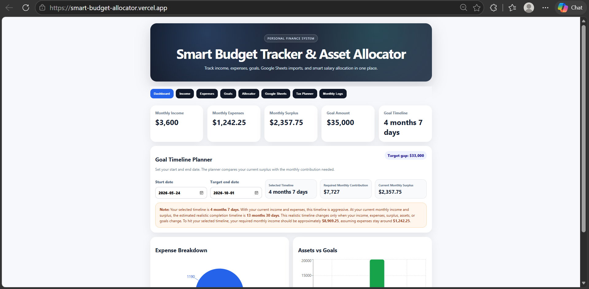
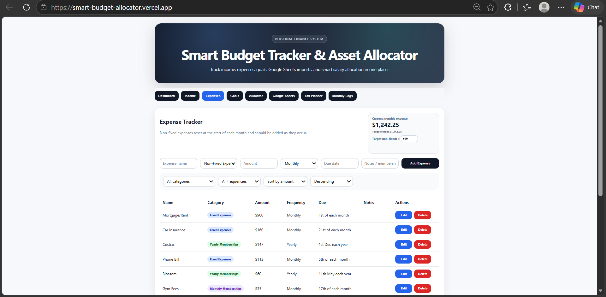
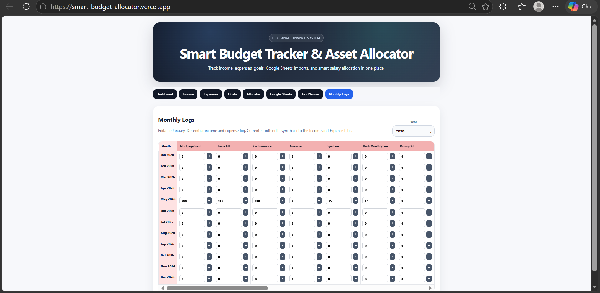

# Smart Budget Tracker & Asset Allocator

<p align="center">
  
  
  
  
  
  
</p>

<p align="center">
  A production-ready full-stack personal finance, budgeting, and smart asset allocation platform.
</p>

---

# Live Demo

|                   Frontend                |                   Backend API Docs               |
|-------------------------------------------|--------------------------------------------------|
| https://smart-budget-allocator.vercel.app | https://smart-budget-allocator.onrender.com/docs |

---

# Overview

A full-stack budget tracking and smart salary allocation system that supports:

|     Frontend    |         Backend      |
|-----------------|----------------------|
| React + Vite UI | FastAPI + SQLite API |

The platform helps users:

- track income streams
- manage fixed and non-fixed expenses
- monitor savings and investment goals
- estimate taxes
- manage yearly financial logs
- import Google Sheets data
- visualize financial progress across devices

---

# Tech Stack

| Frontend         | Backend        | DevOps & Integrations |
|------------------|----------------|-----------------------|
| ⚛️ React         | ⚡ FastAPI     | 🐳 Docker             |
| ⚡ Vite          | 🗄️ SQLite      | ▲ Vercel              |
| 🎨 CSS3          | 📦 SQLAlchemy  | 🚀 Render             |
| 📱 Responsive UI | ✅ Pydantic    | 📊 Google Sheets      |

---

# Key Features

- Interactive React dashboard
- Smart asset allocation engine
- Flexible income streams
- Flexible expense categories
- Monthly and yearly financial tracking
- Google Sheets CSV import
- Optional Google Sheets API integration
- Goal tracking system
- Dynamic yearly logs
- Responsive mobile support
- Real-time allocation calculations
- Deployment-ready architecture
- Expense threshold warnings
- Responsive navigation system
- Mobile table scrolling support
- Dynamic budgeting workflows
- Editable financial logs

---

# Screenshots

<p align="center">
  
  
  
</p>

---

# Current Financial Targets

|    Account   | Current | Target |
|--------------|---------|--------|
| Chequing     |   1100  |   5000 |
| Savings      |    400  |  20000 |
| WealthSimple |    500  |  10000 |

Monthly Income: `3600`

---

# Architecture Overview

```text
Frontend (React/Vite)
        ↓
FastAPI REST API
        ↓
SQLite Database
        ↓
Allocation Engine
        ↓
Goal & Budget Calculations
```

---

# Production Features

- Mobile responsive UI
- RESTful API architecture
- Dockerized frontend/backend services
- Dynamic yearly financial logs
- Real-time allocation calculations
- Responsive horizontal table scrolling
- Automatic expense threshold warnings
- Deployment-ready Vercel + Render setup
- CORS-safe deployment configuration
- Environment-based configuration management

---

# Project Structure

```text
smart-budget-allocator/
├── backend/
│   ├── app/
│   │   ├── api/
│   │   ├── core/
│   │   ├── models/
│   │   ├── schemas/
│   │   └── main.py
│   ├── tests/
│   ├── requirements.txt
│   └── Dockerfile
├── frontend/
│   ├── src/
│   │   ├── api/
│   │   ├── components/
│   │   ├── App.jsx
│   │   ├── main.jsx
│   │   └── styles.css
│   ├── package.json
│   ├── index.html
│   └── Dockerfile
├── google-sheets/
├── docs/
│   ├── screenshots/
│   ├── ARCHITECTURE.md
│   ├── GOOGLE_SHEETS_SETUP.md
│   └── USER_GUIDE.md
├── docker-compose.yml
├── .env.example
├── .gitignore
└── README.md
```

---

# One-Click Local Startup

Run:

```text
start-app.bat
```

This automatically:

- creates backend virtual environment
- installs backend requirements
- installs frontend dependencies
- starts FastAPI
- starts React/Vite
- opens browser automatically
- enables same-network mobile access

To stop local servers:

```text
stop-app.bat
```

---

# Quick Start

## Backend

```bash
cd backend
python -m venv venv
pip install -r requirements.txt
uvicorn app.main:app --reload --port 8000
```

Windows PowerShell:

```powershell
cd backend
python -m venv venv
.\venv\Scripts\Activate.ps1
pip install -r requirements.txt
uvicorn app.main:app --reload --port 8000
```

Backend URL:

```text
http://localhost:8000
```

API Docs:

```text
http://localhost:8000/docs
```

---

## Frontend

```bash
cd frontend
npm install
npm run dev
```

Frontend URL:

```text
http://localhost:5173
```

---

## Docker

```bash
docker compose up --build
```

---

# Google Sheets Support

## CSV Import

1. Open Google Sheets
2. Download as CSV
3. Upload into application
4. Backend parses and stores data

## Google Sheets API Sync

Supports live integration using:

- Google Cloud Project
- Google Sheets API
- Service Accounts

See:

[Google Sheets Setup](docs/GOOGLE_SHEETS_SETUP.md)

---

# Smart Allocation Logic

The backend calculates:

- current surplus
- savings gap
- investment gap
- monthly goal progress
- estimated months to goal
- recommended allocations

Default logic:

```text
IF chequing is below target:
    prioritize chequing + savings
ELSE IF savings is below target:
    prioritize savings + investments
ELSE:
    prioritize investments
```

---

# Monthly Logs System

Features:

- January → December tracking
- Dynamic year selection (2020–2050)
- Editable income and expense entries
- Automatic balance calculations
- Real-time synchronization
- Yearly financial history
- Responsive yearly ledger view

---

# Mobile Support

The application is optimized for:

- Android
- iPhone
- tablets
- desktop browsers

Features include:

- responsive layouts
- horizontal table scrolling
- adaptive spacing
- touch-friendly controls
- responsive navigation tabs

---

# Deployment

Recommended setup:

| Frontend |         Backend        |       Database      |
|----------|------------------------|---------------------|
|  Vercel  | Render / Railway / AWS | SQLite / PostgreSQL |

Deployment files included:

```text
frontend/vercel.json
frontend/.env.production.example
frontend/.env.local.example
render.yaml
backend/start.sh
docs/DEPLOYMENT.md
```

---

# Future Improvements

- PostgreSQL migration
- JWT authentication
- Multi-user support
- AI-powered financial insights
- Financial forecasting engine
- Investment analytics dashboard
- Email reminders
- Automated recurring imports
- Cloud synchronization

---

# Disclaimer

This project is a budgeting and planning tool and does not provide legal, financial, tax, or investment advice.

---

# License

MIT License
